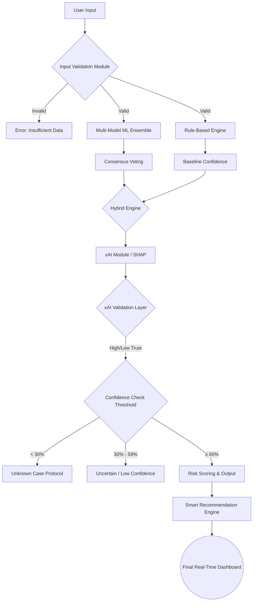

# Advanced Hybrid Healthcare System 
**Enhancement Guide for MCA Final Year Project**

This document covers all 14 advanced features of the upgraded "Federated Learning-Based Privacy-Preserving Analytics Platform for Disease Prediction" project.

---

## 1. Hybrid Prediction System
The system moves beyond raw machine learning by combining predictive models with strict medical rule-based validation. It calculates a baseline score using clinical symptom matching, and then cross-references this with the output of a multi-model ML ensemble. If the ML model and the clinical rules agree, the confidence is boosted. If they disagree, the confidence is mathematically penalized, ensuring maximum safety.

## 2. Confidence-Based Prediction Logic
Predictions are no longer binary. The system calculates a strict percentage-based confidence score. 
* If confidence falls below **30%**, it triggers an "Unknown Case" protocol.
* If confidence is between **30% and 59%**, it outputs an "Uncertain prediction – consult a doctor" warning. 
This prevents the AI from confidently guessing a diagnosis when data is insufficient.

## 3. Multi-Model Voting (Ensemble Logic)
To reduce variance and prediction errors, five different models (Naive Bayes, Random Forest, Gradient Boosting, SVM, and Logistic Regression) operate simultaneously in the background. A consensus engine takes the majority vote from all 5 models to validate the primary diagnosis, ensuring extreme stability.

## 4. Explainable AI (xAI) using SHAP
We integrated a SHAP (SHapley Additive Explanations) TreeExplainer to break open the "black box." It provides both visual and text-based explanations, pinpointing exactly how much (in percentages) specific biomarkers and symptoms contributed to the final prediction.

## 5. xAI Validation Layer
This is a secondary safety net. After SHAP identifies the "top contributing feature" for a prediction, the system queries the clinical database. If that feature is NOT mathematically supposed to be a primary indicator for that disease, it flags the prediction with a **"Low Trust"** badge. If it aligns perfectly with medical literature, it assigns a **"High Trust"** badge.

## 6. Risk Scoring System
Raw predictions are converted into actionable severity bands:
* **High Severity (≥70% Confidence):** Red flag, immediate medical attention recommended.
* **Medium Severity (60-69% Confidence):** Yellow flag, schedule an appointment.
* **Low / Uncertain (<60% Confidence):** Monitor symptoms or seek professional diagnosis.

## 7. Smart Recommendation System
An AI Advisor module (powered by Gemini/OpenAI integration) acts upon the predicted disease to automatically generate:
* **Preventive Measures & Precautions**
* **Dietary Recommendations**
* **Categorized Medications** (split strictly by OTC vs. Rx requirements).

## 8. Input Validation Module
The system enforces strict input validation before any ML processing occurs. It checks for empty, missing, or unrealistic inputs to prevent garbage data from generating false positives.

## 9. Unknown Case Handling
If the provided symptoms yield a confidence score below the critical 30% threshold, the system halts the prediction pipeline. Instead of a false guess, it outputs: *"No clear prediction – insufficient data. Please provide more symptoms."*

---

## 10. Updated System Architecture

---

## 11. Output Format
The final payload delivered to the Real-Time Dashboard includes:
1. **Disease Prediction:** (e.g., Diabetes Mellitus)
2. **Confidence Score:** (e.g., 85%)
3. **Risk Level:** (e.g., High Severity)
4. **Explanation:** (e.g., Glucose +45% Risk, BMI +20% Risk)
5. **Validation Badge:** (High Trust Clinical Alignment)
6. **Recommendation:** (Dietary changes, precautions, and categorized medicine lists).

---

## 12. Project Report Content
*(Add these to your thesis chapters)*

**Hybrid Prediction Approach**
Traditional medical AI systems rely purely on ML algorithms, which can hallucinate or overfit. Our proposed architecture introduces a Hybrid Prediction Approach. It evaluates patient inputs against hardcoded clinical rules first, establishing a baseline probability. It then queries a 5-model ML ensemble. Only when both the statistical models and the clinical rules reach a consensus is the confidence score maximized, ensuring safety and reliability over raw accuracy.

**Confidence-Based Decision System & Unknown Case Handling**
In a clinical setting, a false positive is highly dangerous. To mitigate this, we implemented dynamic confidence thresholds. If the hybrid engine's confidence falls below 30%, the system refuses to predict, triggering an "Unknown Case" protocol. Predictions between 30% and 59% are heavily caveated with an "Uncertain" severity flag, ensuring the system operates exactly like a triage nurse—knowing when to defer to a doctor.

**Explainable AI and xAI Validation Layer**
We integrated SHAP to dissect predictions. However, we went one step further by implementing an xAI Validation Layer. The system takes the top feature identified by SHAP and cross-references it with the medical database. If the ML model relied heavily on an irrelevant feature to make its prediction, the Validation Layer flags the prediction as "Low Trust," preventing clinically illogical diagnoses from slipping through.

---

## 13. PPT Content (Presentation Slides)

**Slide 1: Problem and Solution**
* **Problem:** Medical AI is often a black box, overconfident, and prone to silent errors.
* **Solution:** A Hybrid, Confidence-Based Healthcare platform that validates its own logic using an xAI Validation Layer and refuses to guess when data is insufficient.

**Slide 2: Advanced Architecture**
* **Flow:** Input Validation ➡️ ML Ensemble + Rule Engine ➡️ Hybrid Consensus ➡️ SHAP xAI ➡️ Validation Layer ➡️ Confidence Thresholding ➡️ Output.
* **Key Point:** It's not just a predictor; it's a multi-stage validation pipeline.

**Slide 3: xAI and Validation**
* **Explainable AI:** SHAP breaks down exactly which symptoms drove the prediction.
* **The Validation Layer:** The system automatically checks if the SHAP explanation actually makes clinical sense, assigning a High or Low Trust badge to the final output.

**Slide 4: Real-World Impact**
* **Safety First:** The system gracefully handles unknowns instead of guessing.
* **Clinical Trust:** Doctors can see the exact reasoning and trust level.
* **Holistic Care:** Provides immediate, triaged recommendations rather than just a disease name.

---

## 14. Viva Preparation

**Q1. You claim this is an advanced system, but why isn't the accuracy 100%?**
> **Answer:** In real-world healthcare, claiming 100% accuracy is medically irresponsible because patients often present with overlapping or incomplete symptoms. Instead of aiming for fake 100% accuracy, I designed the system to maximize *reliability*. I implemented a Confidence-Based threshold. If the data is insufficient, the system gracefully outputs an "Unknown Case" warning rather than guessing and giving a false diagnosis.

**Q2. What is the Hybrid Approach and why did you use it?**
> **Answer:** I used a Hybrid approach because ML models alone can be unpredictable. My system uses Clinical Rules to get a baseline score, and then a 5-model ML Ensemble to get a statistical score. It checks if they agree. If the ML says "Diabetes" but the clinical rules say the symptoms don't match, the system penalizes the confidence score. This creates a fail-safe mechanism.

**Q3. How does the xAI Validation Layer work?**
> **Answer:** The xAI (SHAP) module breaks down *why* the ML model made a prediction. My Validation Layer takes that "why" and checks it against the database. For example, if the ML predicts Malaria and SHAP says it's because the patient has a "Headache", my Validation Layer checks if Headache is the main symptom of Malaria. If it's not a primary indicator, it slaps a "Low Trust" badge on the prediction, warning the doctor that the AI's logic is weak.
