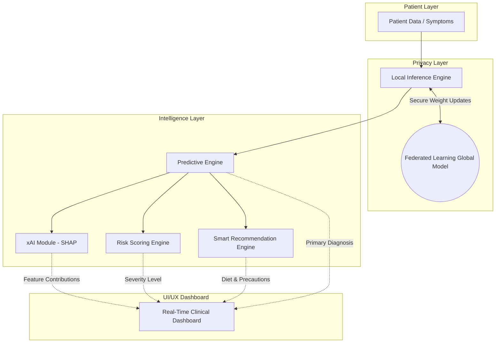

# 🚀 Next-Level Intelligent Healthcare System
**Project Title:** Federated Learning-Based Privacy-Preserving Analytics Platform for Disease Prediction

This document contains the comprehensive upgrade material required to elevate your MCA project to an industry-grade level. It ties together your existing Federated Learning architecture with Explainable AI, Risk Scoring, and Intelligent Recommendations.

---

## 1. Explainable AI (xAI) Integration
**Concept:** Moving beyond "Black Box" predictions.
* **SHAP Implementation:** We integrated SHAP (SHapley Additive Explanations) as a post-prediction layer. By passing patient inputs through a `TreeExplainer`, the system mathematically decomposes the prediction.
* **Visual & Text Explanations:** The dashboard generates real-time visual bars indicating exact percentage contributions of symptoms (e.g., *Cough (+65% Risk), Fever (+19% Risk)*).

## 2. AI Explanation Assistant
**Concept:** Humanizing complex machine learning outputs.
* **Functionality:** The system features an AI-driven text generator that translates raw probability scores into plain English.
* **Example Output:** *"Based on your symptoms, High Fever and persistent Cough are the main reasons for this prediction. Your overall risk profile indicates a Medium severity."*
* **Impact:** Ensures non-technical users (patients) and busy doctors can understand the diagnosis at a glance without reading raw metrics.

## 3. Privacy-Preserving Intelligence
**Concept:** Security at the core of healthcare.
* **Federated Learning (FL):** The model is trained across multiple decentralized devices. Only aggregated mathematical weights—never raw patient data—are sent to the central server.
* **xAI Privacy:** The SHAP explanations are computed strictly on the local inference engine. Because SHAP is model-agnostic, we don't need to send patient data to a central server to generate the explanation.
* **Compliance:** This architecture guarantees zero data leakage, making it fully compliant with healthcare data regulations (like HIPAA/GDPR).

## 4. Risk Scoring System
**Concept:** Actionable triaging over mere prediction.
* **Implementation:** Instead of a simple "Yes/No" classification, the engine calculates a **Confidence Percentage** (e.g., 87%) and cross-references it with a clinical severity matrix.
* **Output Levels:** 
  * 🟢 **Low Risk:** Routine monitoring.
  * 🟡 **Medium Risk:** Schedule doctor appointment.
  * 🔴 **High Risk:** Immediate medical attention required.

## 5. Smart Recommendation System
**Concept:** End-to-end patient care.
* **Preventive Measures:** Automated extraction of health precautions based on the top predicted disease.
* **Lifestyle Changes:** Tailored diet and exercise suggestions dynamically generated by the AI Health Advisor module.
* **Medication Triage:** Categorizes recommended medicines into OTC (Over-The-Counter) and Rx (Prescription Required) with safety warnings.

## 6. Real-Time Dashboard
The web application serves as a comprehensive clinical dashboard.
* **Components:**
  * **Input Matrix:** Real-time symptom/health data entry.
  * **Prediction Result:** Large, clear diagnosis display.
  * **Risk Engine:** Color-coded severity bands and confidence progress bars.
  * **SHAP Graph:** Visual breakdown of the key contributing factors.
  * **Action Center:** AI Insights, Diet, and Precautions.

---

## 7. System Architecture Upgrade

This represents the complete, industry-grade data flow of your project.

---

## 8. Project Report Content

*(Insert these sections into your Project Report / Thesis)*

### 8.1 Privacy-Preserving Federated Learning
In modern healthcare, data silos and privacy regulations prevent the aggregation of sensitive patient records. Our system utilizes a Federated Learning (FL) framework to solve this. Instead of moving data to the model, we move the model to the data. Local nodes train on isolated patient datasets and send only encrypted weight updates to the global aggregator. This ensures that raw biometric data never leaves the hospital's secure environment.

### 8.2 Explainable AI (xAI) Integration
Trust is the most critical component of clinical AI. To eliminate the "black-box" dilemma, we integrated a SHAP-based Explainable AI module. When the federated model generates a diagnosis, the xAI module runs a game-theoretic analysis to determine the marginal contribution of every symptom. This provides doctors with a transparent, quantifiable breakdown of exactly *why* a specific prediction was made, greatly accelerating clinical validation.

### 8.3 Risk Prediction & Intelligent Recommendation System
Prediction alone is insufficient for patient care. The platform features an intelligent pipeline that feeds the raw prediction into a Risk Scoring Engine, calculating a severity index (Low/Medium/High). Concurrently, the Smart Recommendation Engine queries a medical knowledge base to output actionable next steps, including preventive lifestyle changes, dietary restrictions, and OTC medication guidance.

---

## 9. PPT Content (Presentation Slides)

### Slide 1: The Problem Statement
**Title:** The Challenge of Modern Healthcare AI
* **Data Privacy:** Hospitals cannot share patient data due to strict regulations (HIPAA/GDPR).
* **The "Black Box" Problem:** Doctors refuse to use AI if they cannot understand *how* it reached its conclusion.
* **Lack of Actionability:** Simply predicting a disease isn't enough; patients need immediate risk assessment and guidance.

### Slide 2: The Proposed Advanced System
**Title:** A Next-Generation Healthcare Platform
* **Federated Learning:** Trains models across hospitals without sharing raw data. (Solves Privacy)
* **Explainable AI (SHAP):** Provides mathematical proof of why a decision was made. (Solves Trust)
* **Risk & Recommendation Engines:** Converts raw probabilities into actionable lifestyle and medical advice. (Solves Actionability)

### Slide 3: Explainable AI (SHAP) in Action
**Title:** Opening the Black Box
* **Methodology:** We use SHapley Additive Explanations (SHAP) as a post-prediction interpreter.
* **How it works:** It isolates the user's inputs and measures how each factor (e.g., Age, Glucose) shifted the baseline prediction risk.
* **Result:** A visual dashboard showing Doctors exactly which biomarkers triggered the high-risk alert.

### Slide 4: Real-World Impact
**Title:** Why This Matters
* **For Hospitals:** Can collaborate on training powerful AI models without legal risk.
* **For Doctors:** Faster, more confident diagnoses backed by transparent reasoning.
* **For Patients:** Holistic care that provides immediate dietary, lifestyle, and medical guidance based on their specific risk profile.

---

## 10. Viva Preparation (Strong Answers)

**Q1. What makes your project unique compared to standard disease prediction systems?**
> **Answer:** Standard ML projects just take a dataset, train a model, and output a prediction. My project is an end-to-end, industry-grade system. It tackles the two biggest problems in healthcare AI: Privacy and Trust. I used Federated Learning so patient data is never centralized, and I integrated Explainable AI (SHAP) so doctors aren't blindly trusting a machine—they can see exactly which symptoms drove the prediction. Furthermore, it doesn't just stop at prediction; it acts as a complete triaging system with Risk Scoring and Lifestyle Recommendations.

**Q2. How is your system better than normal ML models?**
> **Answer:** Normal ML models are "black boxes"—highly accurate but completely uninterpretable. If a normal model predicts Diabetes, the doctor has to guess *why*. My system uses a SHAP explainer to break down the prediction mathematically. It might say "Confidence is 85% because Glucose contributed +45% and BMI contributed +20%." This transparency makes it suitable for real clinical adoption.

**Q3. How does xAI improve trust in healthcare?**
> **Answer:** In healthcare, accountability is mandatory. A doctor cannot prescribe heavy medication based on a machine's unexplained guess. xAI bridges the gap between machine logic and human reasoning. By showing a visual breakdown of feature importance, the AI acts as an assistant that "shows its work," allowing the doctor to validate the machine's findings against their own medical expertise.

**Q4. Does the Explainable AI module compromise the privacy established by Federated Learning?**
> **Answer:** No, it does not. The SHAP module operates entirely on the local inference layer. It takes the patient's local inputs and evaluates them against the mathematical weights of the global federated model. Since this computation happens on the edge/client side, no raw patient data or specific explanations ever need to be transmitted back to the central server.
