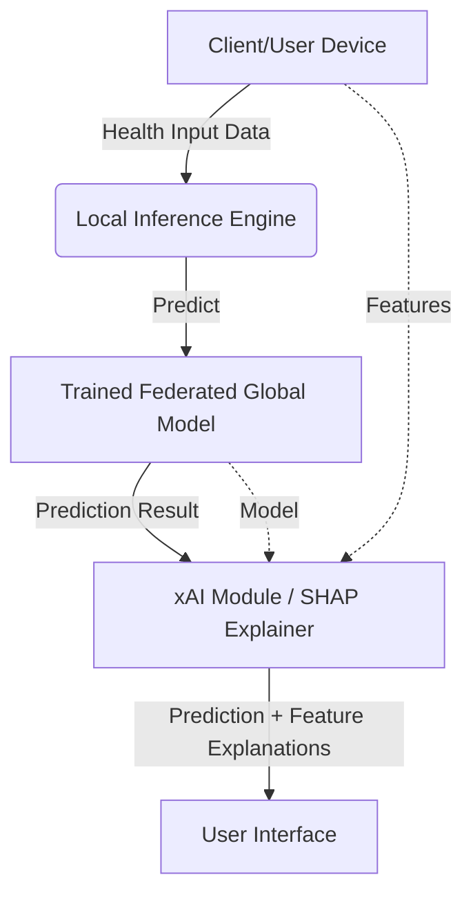

# Explainable AI (xAI) Integration Using SHAP
**Project:** Federated Learning-Based Privacy-Preserving Analytics Platform for Disease Prediction

This document contains all the necessary content to add Explainable AI (xAI) using SHAP into your completed MCA final year project. 

---

## A. Updated System Architecture

The updated architecture introduces an independent Explainable AI (xAI) Module that operates on the output of your existing Federated Learning model. 

**System Flow:**
1. **User Input:** Patient provides health data (e.g., Glucose level, BMI, Age, Blood Pressure).
2. **Federated Learning Model:** The already trained, privacy-preserving global model receives the input and computes the prediction probabilities.
3. **Prediction Output:** The model outputs the predicted disease (e.g., "Diabetes Mellitus - High Risk").
4. **xAI Module (SHAP):** The SHAP explainer takes the user's input and the trained model as references to calculate the Shapley values for each feature.
5. **Final Output:** The system presents the user with both the Prediction and the Visual Explanation (e.g., a SHAP waterfall plot showing which features pushed the risk up or down).

**Architecture Diagram Representation:**

---

## B. Integration Explanation

**Where xAI is Added:**
The xAI module is added as a **post-processing layer** right after the prediction phase in the inference pipeline. It acts as an interpreter that sits between the trained model and the user interface.

**Why No Retraining is Required:**
SHAP (SHapley Additive Explanations) is a *model-agnostic* and *post-hoc* explainability technique. This means it evaluates the model from the outside. By passing the existing, pre-trained model and the specific patient's input data into the `shap.Explainer()`, SHAP calculates the marginal contribution of each feature to the final output. The underlying model weights, federated learning logic, and privacy protocols remain completely untouched and unaltered.

---

## C. Sample Output

**1. Prediction Result:**
* **Diagnosis:** High Risk for Diabetes Mellitus (Confidence: 87%)

**2. Explainable AI Output (SHAP Explanation):**
* **Summary Statement:** "High Glucose level (165 mg/dL) and High BMI (32.5) contributed most significantly to the positive prediction."
* **Feature Breakdown:**
  * ⬆️ **Glucose:** +45% (Increased risk significantly)
  * ⬆️ **BMI:** +20% (Increased risk moderately)
  * ⬆️ **Age (55):** +15% (Increased risk slightly)
  * ⬇️ **Blood Pressure:** -5% (Decreased risk slightly - within normal range)

*(In the actual application, this would be visualized using a SHAP Force Plot or Waterfall Plot.)*

---

## D. Project Report Content

*(Add this section to the "Implementation" or "Proposed System" chapter of your report)*

### Section: Explainable AI (xAI) Integration
In the domain of healthcare, achieving high accuracy in disease prediction is not sufficient; physicians and patients must trust the system's decisions. To address the "black-box" nature of modern machine learning algorithms, an Explainable AI (xAI) module was integrated into the existing federated learning architecture.

**SHAP (SHapley Additive Explanations):**
We utilized SHAP, a game-theoretic approach to explain the output of machine learning models. SHAP assigns each feature an importance value (Shapley value) for a particular prediction. It mathematically guarantees that the sum of the feature contributions equals the difference between the actual prediction and the average model prediction.

**Significance in Healthcare:**
Integrating xAI without altering the pre-trained federated model ensures that the strict privacy-preserving guarantees of the system are maintained. By explicitly identifying which biomarkers (e.g., Glucose levels, BMI) led to a specific disease prediction, the platform empowers medical professionals to validate the AI's reasoning, leading to faster clinical adoption, ethical compliance, and improved patient trust.

---

## E. PPT Content

*(Add these two slides to your presentation)*

### Slide 1: Enhancing Trust with Explainable AI (xAI)
**Title:** Explainable AI in Healthcare
* **The Problem:** Traditional ML models are "black boxes"—they give a prediction without explaining *why*. In healthcare, doctors cannot blindly trust a black box.
* **The Solution:** Explainable AI (xAI).
* **How it works in our project:**
  * Added as a post-prediction layer.
  * **Zero Retraining:** The existing federated model remains untouched, preserving privacy.
  * **Transparency:** Shows exactly which health metrics (e.g., BMI, Glucose) caused the prediction.

### Slide 2: SHAP Integration & Output Example
**Title:** SHAP: SHapley Additive Explanations
* **What is SHAP?** A mathematical method based on game theory that calculates the exact contribution of each feature to a specific prediction.
* **Integration Flow:** Input Data + Trained Model ➡️ SHAP Explainer ➡️ Visual Explanation.
* **Example Output:**
  * *Prediction:* Diabetes Positive (87%)
  * *SHAP Explanation:* 
    * 🔴 Glucose (165) pushed risk UP by 45%
    * 🔴 BMI (32.5) pushed risk UP by 20%
    * 🔵 Blood Pressure (110/70) pushed risk DOWN by 5%

---

## F. Viva Questions and Answers

**Q1: How did you add xAI to an already trained model? Did you have to retrain it?**
**Answer:** No, we did not have to retrain the model. We used a "post-hoc" explainability method called SHAP. We simply pass the already trained model and the user's test data into the SHAP explainer function. SHAP observes how the model's output changes when different inputs are provided, allowing it to calculate feature importance without changing the model itself.

**Q2: Why did you choose SHAP over other explainability methods?**
**Answer:** We chose SHAP because it provides both *local* and *global* interpretability. For healthcare, local interpretability is crucial—we need to explain individual patient predictions accurately. Additionally, SHAP is mathematically solid, based on cooperative game theory, ensuring that the explanations are consistent and reliable.

**Q3: How does adding Explainable AI improve your Federated Learning project?**
**Answer:** Federated Learning handles data privacy by keeping patient data on local devices. However, privacy alone doesn't build trust. If a doctor sees a prediction, they need to know *why* it was made before prescribing treatment. By adding xAI, the project becomes a complete medical solution: it is privacy-preserving (thanks to Federated Learning) and transparent/trustworthy (thanks to SHAP).

**Q4: Doesn't the xAI module compromise the privacy guarantees of Federated Learning?**
**Answer:** No, because the SHAP explanation is generated locally on the client's side (or inference server) during the prediction phase. It only uses the aggregated global model and the user's local input data to generate the explanation. No raw patient data is sent back to the central server to generate these explanations.
